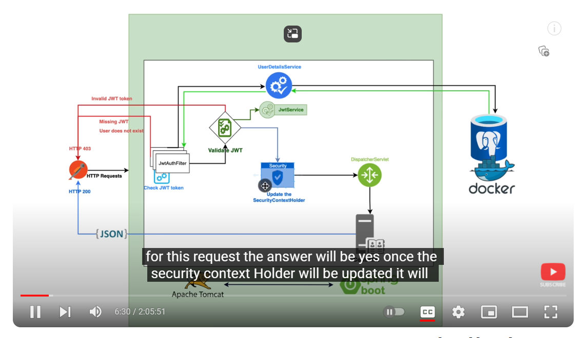
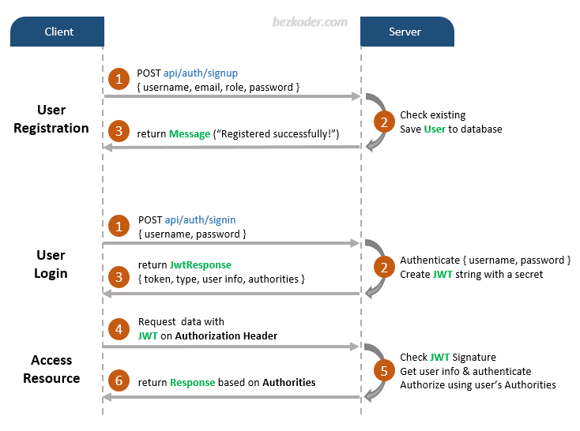

# Getting Started

## Other Resources

- Docker Setup
    - https://earthly.dev/blog/mongodb-docker/
    - https://www.jetbrains.com/help/idea/run-and-debug-a-spring-boot-application-using-docker-compose.html#connect_to_db
    - There is a bug with running spring with docker in intellij with random port mapping so called dat off and only used it for the mongodb service

-Spring Security
- https://www.youtube.com/watch?v=KxqlJblhzfI&t=8s
- 

- HTTP REST standards
    - (Response Status Codes) https://developer.mozilla.org/en-US/docs/Web/HTTP/Status

https://earthly.dev/blog/mongodb-docker/

### Reference Documentation
For further reference, please consider the following sections:

* [Official Apache Maven documentation](https://maven.apache.org/guides/index.html)
* [Spring Boot Maven Plugin Reference Guide](https://docs.spring.io/spring-boot/docs/3.2.1/maven-plugin/reference/html/)
* [Create an OCI image](https://docs.spring.io/spring-boot/docs/3.2.1/maven-plugin/reference/html/#build-image)
* [Spring Reactive Web](https://docs.spring.io/spring-boot/docs/3.2.1/reference/htmlsingle/index.html#web.reactive)
* [Spring Security](https://docs.spring.io/spring-boot/docs/3.2.1/reference/htmlsingle/index.html#web.security)
* [Spring Data Reactive MongoDB](https://docs.spring.io/spring-boot/docs/3.2.1/reference/htmlsingle/index.html#data.nosql.mongodb)
* [Validation](https://docs.spring.io/spring-boot/docs/3.2.1/reference/htmlsingle/index.html#io.validation)

### Guides
The following guides illustrate how to use some features concretely:

* [Building a Reactive RESTful Web Service](https://spring.io/guides/gs/reactive-rest-service/)
* [Securing a Web Application](https://spring.io/guides/gs/securing-web/)
* [Spring Boot and OAuth2](https://spring.io/guides/tutorials/spring-boot-oauth2/)
* [Authenticating a User with LDAP](https://spring.io/guides/gs/authenticating-ldap/)
* [Accessing Data with MongoDB](https://spring.io/guides/gs/accessing-data-mongodb/)
* [Validation](https://spring.io/guides/gs/validating-form-input/)
